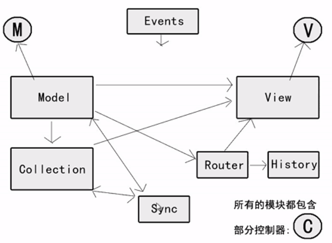

初探backbone:
backbone:一个实现了web前端MVC模式的JS库 。  
Backbone.js为复杂WEB应用程序提供模型(models)、集合(collections)、视图(views)的结构。其中模型用于绑定键值数据和自定义事件；集合附有可枚举函数的丰富API； 视图可以声明事件处理函数，并通过RESRful JSON接口连接到应用程序。  
<!-- more -->
# MVC模式 #
## 模式 ##：一种解决问题的通用方法
- 设计模式：工厂模式，适配器模式，观察者模式等
- 框架模式：MVC、MVP、MVVM等  

## MVC指: ##
M ： model  (模型)  
V ：  view (视图)  
C ：  controller  (控制器)  

## MVC模式的思想 ##
就是把模型与试图分离，通过控制器来连接他们  
服务器端MVC模式非常容易实现  

## Web前端MVC模式 ##
Web页面本身就是一个大的view，不容易做到分离操作。  
backbone适合复杂的大型开发http://documentcloud.github.io/backbone/  
 
# backbone的模块 #
Events ： 事件驱动方法  
Model ： 数据模型   
Collection ： 模型集合器  
Router ： 路由器(hash)  
History ： 开启历史管理  
Sync ： 同步服务器方式  
View ： 试图(含事件行为和渲染页面)  

  
# Backbone入门 # 
了解Jquery   服务器环境   面向对象  
**[Underscorejs库](http://www.css88.com/doc/underscore/)**：一些数组，对象，事件的常用方法，针对模型和集合 ，Backbone唯一重度依赖的库   
**Jquery库**：针对视图实现具体效果   

## 基本使用 ##
1. 直接创建对象
2. 给构造函数添加实例方法和静态方法
3. 继承操作
4. 自定义事件
5. 数据与服务器
6. 路由与历史管理
7. 事件委托
8. 前端模版  

## 具体 ##
模型是保存应用程序数据的地方。你可以把模型想像为对应用程序原始数据的精心设计的抽象，并且添加了一些工具函数和事件。

视图并不是模板本身，却是一些控制类，它们处理模型的表现。在 Backbone 中，视图“代表了一个 UI 逻辑块，负责一个简单的DOM 的内容” 。  
视图也扩展自 Backbone 的现存类——这里就是 Backbone.View 。  

Backbone 的控制器将应用程序的状态和 URL 的哈希片段关联在一起，使 URL 地址可分享，也可作为书签使用。本质上，控制器由一些路由和函数构成，当导航到这些路由时那些函数就会被调用。  

## 具体 ##
Backbone唯一重度依赖的是Underscore.js 
histroy的支持依赖于Backbone.Route
DOM处理依赖于 Backbone.View 

通过Backbone，可以将数据呈现为 Models, 对模型进行创建，验证和销毁，以及将它保存到服务器。 
任何时候只要UI事件引起模型内的属性变化，模型会触发"change"事件。

所有显示模型数据的 Views 会接收到该事件的通知，继而视图重新渲染
无需查找DOM来搜索指定id的元素去手动更新HTML。 — 当模型改变了，视图便会自动变化。

## Backbone.Events（事件） ##
可以在Models（模型），Collection（集合），Views（视图）上自由地触发这些事件，只要你认为合适。
add  
change change:[attribute]  
all
## Backbone.Model（模型） ##
Models（模型）是任何Javascript应用的核心，包括数据交互及与其相关的大量逻辑： 转换、验证、计算属性和访问控制。你可以用特定的方法扩展 Backbone.Model，Model 也提供了一组基本的管理变化的功能
### extend ###
    Backbone.Model.extend(properties, [classProperties]) 
要创建自己的 Model 类，你可以扩展 Backbone.Model 并提供实例 properties(属性) ， 以及可选的可以直接注册到构造函数的classProperties(类属性)。  
extend 可以正确的设置原型链，因此通过 extend 创建的子类 (subclasses) 也可以被深度扩展。
### constructor / initialize ###
如果定义了 initialize 函数，该函数会在model创建后执行。

### get ###
从当前model中获取当前属性(attributes)值

    model.get(attribute)
比如： note.get("title")  

### set ###
向model设置一个或多个hash属性(attributes)

    model.set(attributes, [options]) 
如果任何一个属性改变了model的状态，在不传入 {silent: true} 选项参数的情况下，会触发 "change" 事件，更改特定属性的事件也会触发。 可以绑定事件到某个属性，例如：change:title，及 change:content。  
  
    note.set({title: "March 20", content: "In his eyes she eclipses..."});    
    book.set("title", "A Scandal in Bohemia");

### has ###
属性值为非 null 或非 undefined 时返回 true  

    model.has(attribute) 
### defaults ###
defaults 散列（或函数）用于为模型指定默认属性。   
创建模型实例时，任何未指定的属性会被设置为其默认值。
 
    model.defaults or model.defaults() 

### sync ###
使用 Backbone.sync 可以将一个模型的状态持续发送到服务器。 可以自定义行为覆盖。

    model.sync(method, model, [options])
### fetch ###
### save ###
通过委托给Backbone.sync，保存模型到数据库（或替代持久化层）

## Backbone.Collection（集合） ##
集合是模型的有序组合，我们可以在集合上绑定 "change" 事件，从而当集合中的模型发生变化时fetch（获得）通知，集合也可以监听 "add" 和 "remove" 事件， 从服务器更新，并能使用 Underscore.js 提供的方法。

集合中的模型触发的任何事件都可以在集合身上直接触发，所以我们可以监听集合中模型的变化： documents.on("change:selected", ...) 

### model ###
覆盖此属性来指定集合中包含的模型类。

    collection.model 
可以传入原始属性对象（和数组）来 add, create,和 reset，传入的属性会被自动转换为适合的模型类型。

    var Library = Backbone.Collection.extend({
  		model: Book
	});

### constructor / initialize ###
    new Backbone.Collection([models], [options]) 
如果定义了 initialize 函数，会在集合创建时被调用。
有几个选项，如果提供的话，将直接附加到集合上：model 和comparator。
### Underscore 方法 (32)  ###
#### reset ####
 使用reset，将一个新的模型（或属性散列）列表替换集合，最后触发一个但单独的"reset"事件。
#### set ####
#### get ####
通过一个id，一个cid，或者传递一个model来 获得集合中 的模型。

    collection.get(id) 
	eg：var book = library.get(110);
#### at ####
获得集合中指定索引的模型

    collection.at(index) 
不论你是否对模型进行了重新排序，at始终返回其在集合中插入时的索引值。
#### where ####
    collection.where(attributes) 
返回集合中所有匹配所传递 attributes（属性）的模型数组。 对于简单的filter（过滤）比较有用。

    var friends = new Backbone.Collection([
	  	{name: "Athos",      job: "Musketeer"},
	  	{name: "Porthos",    job: "Musketeer"},
	  	{name: "Aramis",     job: "Musketeer"},
	  	{name: "d'Artagnan", job: "Guard"},
	]);

	var musketeers = friends.where({job: "Musketeer"});

	alert(musketeers.length);  //3
#### url ####
设置 url 属性（或函数）以指定集合对应的服务器位置。集合内的模型使用 url 构造自身的 URLs。
#### clone ####
返回一个模型列表完全相同的集合新实例。

    collection.clone() 
#### fetch ####
从服务器拉取集合的默认模型设置 ，成功接收数据后会setting（设置）集合。

    collection.fetch([options]) 
## Backbone.Router（路由） ##
web应用程序通常需要为应用的重要位置提供可链接，可收藏，可分享的 URLs。 Backbone.Router 为客户端路由提供了许多方法，并能连接到指定的动作（actions）和事件（events）。  
页面加载期间，当应用已经创建了所有的路由，需要调用 `Backbone.history.start()`，或`Backbone.history.start({pushState: true}) `来确保驱动初始化 URL 的路由。
## Backbone.history ##
History 作为全局路由服务用于处理 hashchange 事件或 pushState，匹配适合的路由，并触发回调函数。 
Backbone 会自动判断浏览器对 pushState 的支持，以做内部的选择。
## Backbone.sync（同步） ##
Backbone.sync 是 Backbone 每次向服务器读取或保存模型时都要调用执行的函数。 默认情况下，它使用 jQuery.ajax 方法发送 RESTful json 请求，并且返回一个 jqXHR。 
## Backbone.View（视图） ##
Backbone 视图包括HTML或CSS，并可以配合使用任何JavaScript模板库。  
一般是组织您的接口转换成逻辑视图，通过模型的支持，模型变化时，每一个都可以独立地进行更新，而不必重新绘制该页面。    
通过绑定视图的 render 函数到模型的 "change" 事件 — 模型数据会即时的显示在 UI 中。
### extend ###
开始创建自定义的视图类。

    Backbone.View.extend(properties, [classProperties])

通常我们需要重载render函数，声明events，以及通过tagName,className,或id为视图指定根元素。
  
### el ###
所有的视图都拥有一个 DOM 元素（el 属性），即使该元素仍未插入页面中去。

	view.el 
this.el 可以从视图的tagName,className,id和attributes创建，如果都未指定，el会是一个空div。
### $ (jQuery) ###
如果页面中引入了 jQuery，每个视图都将拥有 $ 函数，可以在视图元素查询作用域内运行。 如果使用该作用域内的 jQuery 函数，就不需要从列表中指定的元素获取模型的 ids 这种查询了，我们可以更多的依赖 HTML class 属性。 它等价于运行：`view.$el.find(selector)`。

	ui.Chapter = Backbone.View.extend({
  		serialize : function() {
    		return {
      			title: this.$(".title").text(),
      			start: this.$(".start-page").text(),
      			end:   this.$(".end-page").text()
    		};
  		}
	});

### template ###
模板化的视图 不是Backbone直接提供的一个功能，在视图定义template函数很好的约定。如此，渲染视图时，可以方便地访问实例数据。

	var LibraryView = Backbone.View.extend({
 		template: _.template(...)
	});
### render ###
render 默认实现是没有操作的。 重载本函数可以实现从模型数据渲染视图模板，并可用新的 HTML 更新 this.el。