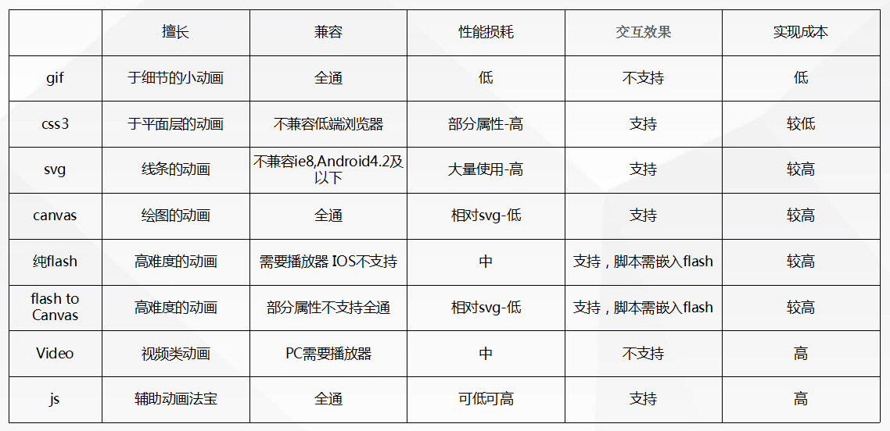

## H5动画 ##
### 方法一：GIF ###
### 方法二：逐帧动画 ### 
<!-- more -->
逐帧动画即是利用一张等间距的动画分解逐帧图片，由js脚本模拟编写或是使用css3新属性step()制作而成  
做一个逐帧动画必不可缺的就是需要一张等间距的“动画分解逐帧图片.png”，再通过JavaScript脚本或CSS3 animation的过度函数step() 来控制图片的background-position，二者结合就可以快速输出一个逐帧动画
参考：[http://w.benbun.com/momo/shaibingxiang/](http://w.benbun.com/momo/shaibingxiang/)  
### 方法三：css3 ###

#### CSS3的动画三大属性：Transform 变形，Transition 过渡，和Animation 动画 ####
Transform 变形：拥有 rotate 旋转 skew 扭曲 scale 缩放 translate 移动 matrix 矩阵变形五大特效，罗斯的例子中，便是对充分结合了这几个变化特效的产物。  

Transition 过渡：拥有修改执行变换的属性，时长，速率和延迟时间的能力，大家都很熟悉的贝塞尔曲线，也是归属于transition的设定之下的。

Animation 动画：若将Transform解释为动作，Transition解释为过渡，那么Animation则是连续的几个动作，即动画。Animation可以我们设定keyframes的值，让元素在一段时间内完成多个动作  
### 方法四：SVG ###
擅长于线条的动画  
SVG，可缩放矢量图形（Scalable Vector Graphics）， 是被存成了 XML 格式的图像，它有一些特别的地方：

- 可被多种工具读取和修改（比如记事本）
- 尺寸更小，可压缩性更强
- 矢量
- 纯粹的 XML

### 方法五：Canvas ###
HTML5 的新元素 <canvas>，类似画板，拥有多种绘制路径、矩形、圆形、字符以及添加图像的方法。
### 方法六：Flash->Canvas ###
通过Flash cc制作复杂又精细的动画，导成Canvas文件，动画中的交互操作，依赖Create.js的脚步库完成。
### 方法七：video ###
### 方法八：JavaScript ### 
所有的动画特效都离不开Javascript的支持 

来源网站：[H5动效的常见制作手法](https://isux.tencent.com/h5active.html)