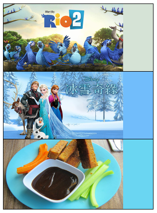

前一段时间，做UI的同事给我看了一个APP，大致是展示图片类型的，印象较深的是，因为是图片类APP，在内容加载上应该和网页一样，存在图片加载不完全的情况，一般的做法是给图片所在区域统一设置一个背景色，或者类似“图片正在加载”“XXX（产品名字）”，记得那个APP的做法是取每张图片的相关色，应该是主色，作为图片尚未完全加载时的背景色，每张图片内容不同，背景色也就不同了。当时UI说这个体验觉得很好，看看能不能借鉴。在网上找了一些资源，觉得rgbaster.js正是我们想要的效果，记录下来，方便以后使用。
<!-- more -->
### 使用 ###
rgbaster.js压缩后很小，不到2k，不用担心引入造成文件过大问题  

下载rgbaster.js后，引入到需要使用的项目中，如下按自己的项目需求使用即可：

    

	

		
	

	

效果图：  

  
注：为了直观看出图片与背景颜色的关系，此处只让图片显示在左侧80%的宽度，右侧20%为上述设置的背景色

### github地址 ###
rgbaster.js：[https://github.com/briangonzalez/rgbaster.js](https://github.com/briangonzalez/rgbaster.js)   
Color Thief：[https://github.com/lokesh/color-thief/](https://github.com/briangonzalez/rgbaster.js)

详细使用参考：  
[图片主色获取脚本rgbaster.js小介绍小使用](http://www.zhangxinxu.com/wordpress/2014/08/image-dominant-color-get-rgbaster-js/)  
[使用rgbaster.js插件实现根据背景图片自动设置主题风格颜色的功能](http://www.w3cfuns.com/notes/17100/a8cb9c4a32ed4e996bcad9a4e1548e0c:storey-2)